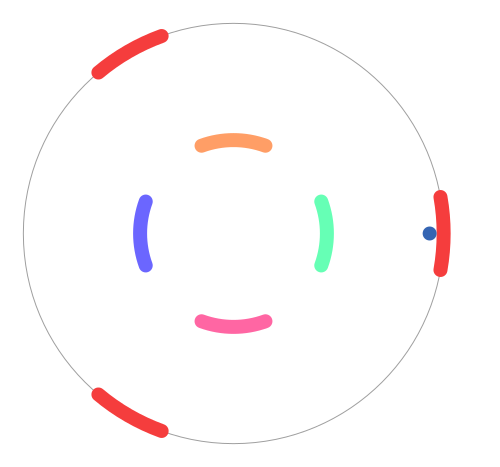

# Creakout

A circular breakout game written with Pharo.

## Advancement

Basic gameplay is working, with two levels. Nothing extravagant for now.

### Possible improvements

- Add more levels
- Add more gameplay elements (bonus, extra lives, moving bricks...)
- Deploy to the web using PharoJS

## How to install

Clone this repository.

In monticello, add the folder `repository` as a filetree
repository. You can then import the source in your image.

Run the game by doing `CreakoutMorphic start`

## Commands

- left and right: move the pads
- up: shoot the ball

When the game is finished, press any key to restart.

## Known issues

- Random freezes on Pharo 5 (apparently solved in Pharo 6)
- The keys aren't properly mapped on Mac OS
